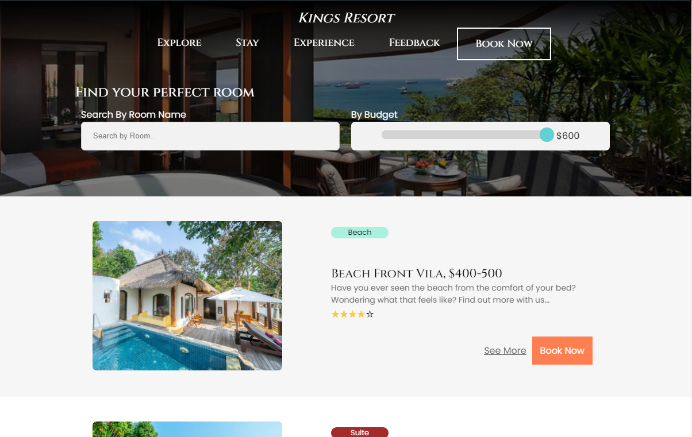

# Kings Resort Hotel
A part of a school project which was to design and build a functional website for a Resort Hotel.

# My role in this project
I worked on the Rooms Page, Individual Rooms Page and the Rooms Booking Page
Everything on these pages are done by me, including the navigation bar and footer:
 https://jolenechong.github.io/kingsResortHotel/index.html

# Our Purpose
Let’s have a look at the WHY behind our project. Every hotel needs a good website, it is the face of the hotel! The design of our website is made with consistency adhering to the brand and trademark of the Kings Resort Hotel. Hotel Websites are a good source of information for prospective guests and can directly impacts sales. We understand the importance of User Experience. So we made it a point to view from the perspective of our users and find out the challenges that they face, to enable us to  make the process of finding what they want on the website more quickly and efficiently, leaving our users happy and in turn ore likely to book a room or event with us.

#Our Approach
Our approach to solve these problems were to first decide the contents of our website, what pages are needed in a hotel website? How can we stand out? 
Next was our research phase, what do other hotel websites look like and have? What do users look for when looking for a hotel room? 
Then, we sketched out ideas on paper and made our HTML/CSS prototype. Then, we worked on responsiveness and usability with the help of Javascript. So who are our users?

# Is it Mobile-Responsive?
<video controls>
  <source src="mobileView1.webm" type="video/webm">
Your browser does not support the video tag.
</video>

74% of users are more likely to return to a mobile-friendly website, so what can we do with that information? With that, we made it a point to make our website mobile-responsive, this is how it looks on mobile.

